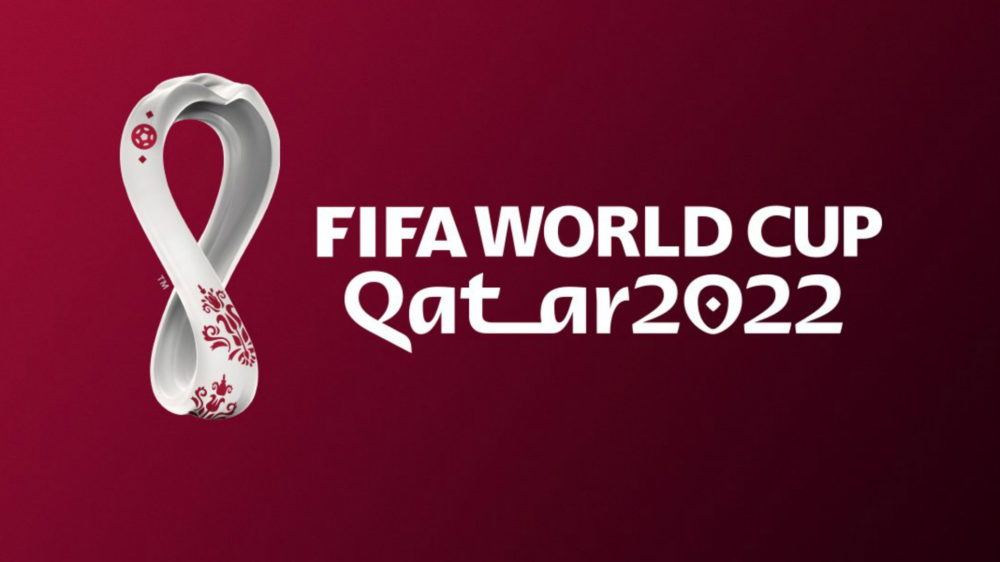

# FIFA_World_Cup_2022_Predicions

This is a personal project done to have fun with Machine Learning.

The data comes from the kaggle dataset available on this link: https://www.kaggle.com/datasets/brenda89/fifa-world-cup-2022

The project is fully available on the notebook file including EDA, training and predictions.

The current model is only a v1, the goal being to improve it step by step before the world cup.

I will also clean up and comment on the notebook in the next few days.

